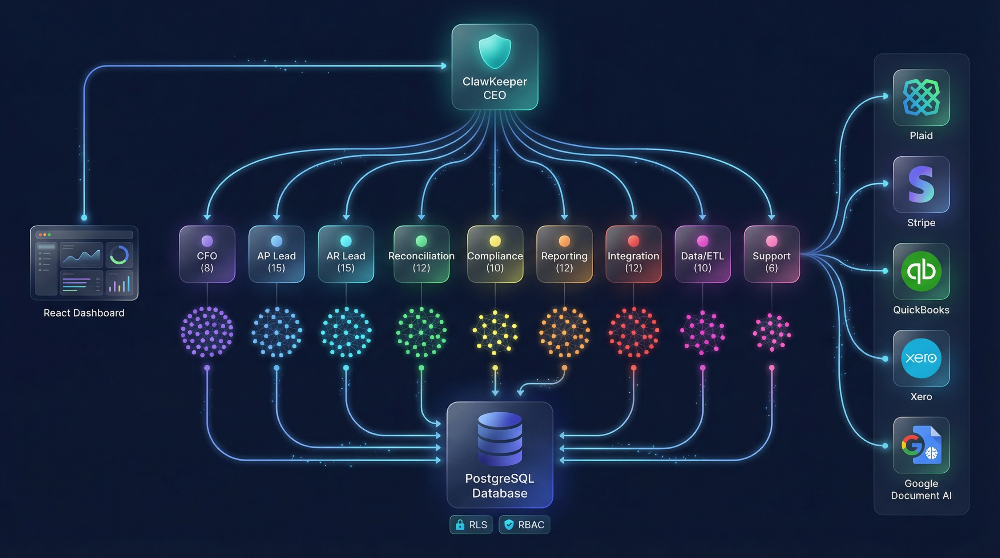

<div align="center">


# ClawKeeper

### Your AI Bookkeeper That Never Sleeps

**110 autonomous AI agents working 24/7 so you never touch a spreadsheet again.**

[](LICENSE)
[](https://bun.sh)
[](https://www.typescriptlang.org/)
[](https://react.dev)
[](https://deepseek.com)

[Quick Start](#-quick-start) · [Architecture](#-architecture) · [Features](#-features) · [API Docs](#-api-reference) · [Contributing](CONTRIBUTING.md)

---


</div>

## The Problem

Small and medium businesses spend **120+ hours per year** on bookkeeping. Manual invoice processing, bank reconciliation, and financial reporting drain time, money, and sanity. Hiring a full-time bookkeeper costs $45K–$65K/year. Outsourcing to a firm? $500–$2,500/month.

## The Solution

ClawKeeper deploys a **full AI accounting department** — a CEO agent that orchestrates 9 team leads and 100 specialized workers — to handle your entire bookkeeping operation autonomously. One natural language command. 110 agents. Zero spreadsheets.

> *"Generate monthly P&L report and reconcile all accounts"*
>
> That's it. ClawKeeper's CEO agent decomposes the task, delegates to the right teams, and delivers results in real-time.

---

## Why ClawKeeper?

| Feature | Traditional | ClawKeeper |
|---|---|---|
| **Invoice Processing** | Manual entry, 5–10 min each | AI OCR + auto-categorization in seconds |
| **Bank Reconciliation** | Hours of matching transactions | Automatic matching with discrepancy detection |
| **Financial Reports** | Days to compile | Generated on-demand, any time |
| **Cost** | $45K–$65K/year (in-house) | Self-hosted, pay only for AI inference |
| **Availability** | Business hours | 24/7/365 |
| **Multi-Tenant** | One client at a time | Unlimited tenants, full data isolation |

---

## Features

- **One-Prompt Deployment** — Deploy 110 AI agents with a single natural language command
- **Autonomous Invoice Processing** — AI-powered OCR via Google Document AI, validation, and categorization
- **Bank Reconciliation** — Automatic transaction matching and discrepancy detection via Plaid
- **Financial Reporting** — P&L, Balance Sheet, Cash Flow, AP/AR Aging, and custom reports
- **Multi-Tenant Architecture** — Complete tenant isolation with Row-Level Security and RBAC
- **110-Agent Hierarchy** — CEO + 9 orchestrators + 100 specialized workers
- **DeepSeek AI Integration** — Cost-efficient AI reasoning (10–100x cheaper than GPT-4)
- **Real-Time Execution Streaming** — Watch agents collaborate live via WebSocket + SSE
- **Production Security** — Rate limiting, circuit breakers, PII detection, audit trails
- **Modern Dashboard** — React + Vite + Tailwind + Shadcn with Command Center UI

---

## Architecture

<div align="center">

</div>

ClawKeeper follows a **hierarchical multi-agent architecture** inspired by how real accounting departments operate:

```
ClawKeeper CEO (Top-Level Orchestrator)
│
├── CFO Agent ──────────────── 8 workers  (Strategic planning, forecasting, budgeting)
├── Accounts Payable Lead ──── 15 workers (Invoice processing, payments, expense tracking)
├── Accounts Receivable Lead ─ 15 workers (Customer invoicing, collections, revenue tracking)
├── Reconciliation Lead ────── 12 workers (Bank matching, discrepancy resolution)
├── Compliance Lead ─────────── 10 workers (Tax compliance, audit preparation)
├── Reporting Lead ──────────── 12 workers (Financial reports, dashboards, analytics)
├── Integration Lead ────────── 12 workers (Plaid, Stripe, QuickBooks, Xero sync)
├── Data/ETL Lead ───────────── 10 workers (Data import, transformation, validation)
└── Support Lead ────────────── 6 workers  (User assistance, error recovery)
```

### Tech Stack

| Layer | Technology |
|---|---|
| **Runtime** | Bun |
| **Language** | TypeScript (strict mode) |
| **API Server** | Hono |
| **Dashboard** | React 18 + Vite + Tailwind CSS + Shadcn/UI |
| **Database** | PostgreSQL with RLS + RBAC |
| **AI Engine** | DeepSeek AI |
| **OCR** | Google Document AI |
| **Banking** | Plaid |
| **Payments** | Stripe |
| **Accounting Sync** | QuickBooks, Xero |
| **Real-Time** | WebSocket + Server-Sent Events |

---

## Quick Start

> **Detailed setup instructions:** See [STARTUP.md](./STARTUP.md) for troubleshooting and advanced configuration.

### Prerequisites

- **[Bun](https://bun.sh)** >= 1.0.0
- **PostgreSQL** >= 14
- **DeepSeek API Key** — [Get one here](https://platform.deepseek.com/api_keys)

### 1. Clone and Install

```bash
git clone https://github.com/Alexi5000/ClawKeeper.git
cd ClawKeeper
bun install
```

### 2. Configure Environment

```bash
cp .env.example .env
```

Set your `DEEPSEEK_API_KEY` in `.env` (and optionally Plaid, Stripe, QuickBooks, Xero keys).

### 3. Setup Database

```bash
# One-command setup (schema + RLS + RBAC + seed data)
bun run setup:full
```

Or manually:

```bash
createdb clawkeeper
bun run db:setup
bun run setup:demo
```

### 4. Start Services

```bash
# Terminal 1: API Server (default port 9100)
bun run dev

# Terminal 2: Dashboard (default port 3000)
bun run dashboard:dev
```

### 5. Launch the Command Center

Open [http://localhost:3000](http://localhost:3000) and log in:

| Field | Value |
|---|---|
| Email | `admin@demo.com` |
| Password | `password123` |

Navigate to **Command Center**, type a command like *"Generate monthly P&L report and reconcile all accounts"*, and watch 110 agents go to work.

---

## Skills

ClawKeeper ships with **8 production-ready skills** that agents use to perform specialized tasks:

| Skill | Description |
|---|---|
| `invoice-processor` | OCR extraction, validation, and categorization of invoices |
| `bank-reconciliation` | Automatic transaction matching and discrepancy detection |
| `financial-reporting` | P&L, Balance Sheet, Cash Flow, and custom report generation |
| `payment-gateway` | Payment processing and disbursement via Stripe |
| `compliance-checker` | Tax compliance validation and audit trail generation |
| `document-parser` | Multi-format document parsing (PDF, images, spreadsheets) |
| `data-sync` | Bidirectional sync with QuickBooks and Xero |
| `audit-trail` | Immutable logging of all financial actions |

---

## API Reference

### Authentication

```
POST /api/auth/login          # User authentication
POST /api/auth/register       # New user registration
```

### Invoices

```
GET    /api/invoices              # List invoices
POST   /api/invoices/upload       # Upload invoice for AI processing
POST   /api/invoices/:id/approve  # Approve invoice
POST   /api/invoices/:id/pay      # Mark as paid
```

### Reports

```
GET /api/reports/:type
```

Supported types: `profit_loss`, `balance_sheet`, `cash_flow`, `ap_aging`, `ar_aging`

### Reconciliation

```
POST /api/reconciliation/start       # Start reconciliation task
GET  /api/reconciliation/:id/status  # Check reconciliation status
```

### Real-Time

```
WS /ws    # WebSocket for live agent execution updates
```

> Full API documentation: [docs/API.md](./docs/API.md)

---

## Security

ClawKeeper is built for production financial workloads with enterprise-grade security:

- **Row-Level Security (RLS)** — Tenant data isolation enforced at the database level
- **Role-Based Access Control** — 4 roles: `super_admin`, `tenant_admin`, `accountant`, `viewer`
- **Immutable Audit Trail** — Every financial action is logged and tamper-proof
- **Rate Limiting** — Per-tenant and per-endpoint rate limits
- **Circuit Breaker** — Automatic protection for external API failures
- **Input Validation** — Zod schemas enforce strict typing on all API inputs
- **PII Detection** — Prevents sensitive data from leaking to LLM providers

> Full security documentation: [SECURITY.md](./SECURITY.md)

---

## Project Structure

```
ClawKeeper/
├── agents/                # 110 agent definitions (CEO + orchestrators + workers)
│   ├── clawkeeper/       # CEO agent
│   ├── orchestrators/    # 9 team lead agents
│   └── workers/          # 100 specialized worker agents
├── skills/                # 8 production-ready skills
├── src/
│   ├── api/              # Hono API server
│   ├── agents/           # Agent runtime implementations
│   ├── core/             # Types, orchestrator engine, scheduler
│   ├── integrations/     # Plaid, Stripe, QuickBooks, Xero, Document AI
│   ├── memory/           # Agent memory and context system
│   ├── guardrails/       # Security, validation, PII detection
│   └── db/               # Database queries and migrations
├── dashboard/             # React admin dashboard (Vite + Tailwind + Shadcn)
├── db/                    # SQL schema, RLS policies, RBAC, seed data
├── docs/                  # Extended documentation
├── config/                # Configuration files
└── scripts/               # Deployment and utility scripts
```

---

## Documentation

| Document | Description |
|---|---|
| [STARTUP.md](./STARTUP.md) | Detailed startup guide with troubleshooting |
| [Architecture](./docs/ARCHITECTURE.md) | System design and agent hierarchy |
| [API Reference](./docs/API.md) | Complete API documentation |
| [Deployment Guide](./docs/DEPLOYMENT.md) | Production deployment instructions |
| [Multi-Tenancy](./docs/MULTI-TENANCY.md) | Tenant isolation and RBAC configuration |
| [Security](./SECURITY.md) | Security model and best practices |
| [Contributing](./CONTRIBUTING.md) | Contribution guidelines |

---

## Development

### Adding a New Agent

1. Create the agent definition: `agents/<category>/<name>/AGENT.md`
2. Implement the runtime: `src/agents/<name>.ts`
3. Register in `src/agents/index.ts`
4. Deploy: `./scripts/deploy.sh`

### Adding a New Skill

1. Create the skill definition: `skills/<name>/SKILL.md`
2. Update the skills index: `SKILLS.md`
3. Deploy: `./scripts/deploy.sh`

### Testing

```bash
bun test              # Run all tests
bun run typecheck     # TypeScript type checking
bun run lint          # ESLint
```

---

## Roadmap

- [ ] Multi-currency support
- [ ] AI-powered cash flow forecasting
- [ ] Automated tax filing preparation
- [ ] Mobile companion app
- [ ] Slack/Teams integration for notifications
- [ ] Custom agent builder UI

---

## License

MIT — see [LICENSE](./LICENSE) for details.

---

<div align="center">

**Built by [Alex Cinovoj](https://github.com/Alexi5000) · Powered by [TechTide AI](https://github.com/Alexi5000/TechTideAI2)**

*Stop doing bookkeeping. Start building your business.*

</div>
